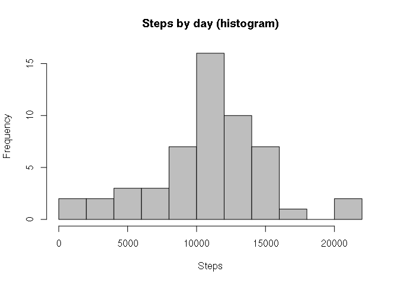
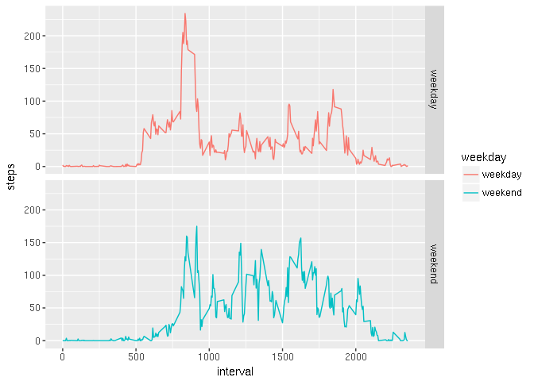

# Reproducible Research: Peer Assessment 1

## Introduction
This document contains the **Reproducible Research** assignment for Week #2 at **John Hopkins University**'s DataScience course.

## Loading and preprocessing the data
The DataSet is provided in a ZIP file. The first task consists in decompress the file, load the DataSet and prepare the data.


```r
# Unzip the file
unzip( "activity.zip" )

# DataSet load
activity_data <- read.csv( "activity.csv" )
```

We will keep the original DataSet in the `activity_data` DataFrame and a clean set (without 'NA' values) in the `complete_data` DataFrame.


```r
# Remove the NA entries
complete_dataset <- activity_data[ complete.cases( activity_data ), ]
```


## What is mean total number of steps taken per day?

Let's plot a histogram about the daily steps.


```r
# Aggregate the steps (by day)
steps_by_day <- aggregate( steps ~ date, complete_dataset, FUN=sum )

# Plot a histogram (steps by day) using the complete dataset
hist(steps_by_day$steps,
     main="Steps by day (histogram)",
     xlab="Steps",
     breaks=10,
     col="grey")
```

<!-- -->

Now let's get the Mean and Median.


```r
# Compute the data summary
steps_by_day_summary <- summary( steps_by_day$steps )

# The mean
steps_by_day_mean <- steps_by_day_summary["Mean"]

# The median
steps_by_day_median <- steps_by_day_summary["Median"]
```

The results:

| Mean | Median| 
| --- | ---| 
| 10766 | 10765|


## What is the average daily activity pattern?

In order to determine which 5-minute period contains the maximum number of steps,
we will plot the average number or steps (across all days).


```r
# Aggregate the steps by interval
mean_steps_by_interval <- aggregate( steps ~ interval, complete_dataset, FUN=mean )

# Plot
plot( x=mean_steps_by_interval$interval,
      y=mean_steps_by_interval$steps,
      type="l",
      col="blue",
      main="Steps by 5-minute interval",
      xlab="Interval",
      ylab="Steps")
```

<!-- -->

Let's look for the highest number of steps interval:


```r
# The row with the maximum steps
max_interval <- mean_steps_by_interval[ which.max( mean_steps_by_interval$steps ), ]
```

| Maximum interval | Maximum value | 
| --- | ---| 
| 835 | 206.169811320755|


## Imputing missing values

#### Calculate and report the total number of missing values in the dataset (i.e. the total number of rows with NAs)

We can just sum all the NAs with:


```r
# Sum of NAs
na_count <- sum( is.na( activity_data$steps ) )
```

| Data entries with NAs |
| --- |
| 2304 |


#### Devise a strategy for filling in all of the missing values in the dataset. The strategy does not need to be sophisticated. For example, you could use the mean/median for that day, or the mean for that 5-minute interval, etc.

We will fill the NA values with the mean steps for the 5-minute interval.

We use the `mean_steps_by_interval` dataframe that contains the desired values.


#### Create a new dataset that is equal to the original dataset but with the missing data filled in.

First, we duplicate the activity dataset, and then we will replace the NA values
with the correspondent value in the `mean_steps_by_interval` dataset.


```r
# Duplicate the data set
filled_data = activity_data

# With a little help of StackOverflow:
# https://stackoverflow.com/questions/13234005/filling-missing-values
filled_data$steps[ is.na( filled_data$steps ) ] <- mean_steps_by_interval$steps[
                            which( is.na( filled_data$steps ), arr.ind=TRUE ) ]
```


#### Make a histogram of the total number of steps taken each day and Calculate and report the mean and median total number of steps taken per day. Do these values differ from the estimates from the first part of the assignment? What is the impact of imputing missing data on the estimates of the total daily number of steps?

Let's plot again the histogram.


```r
# Aggregate the steps (by day)
filled_steps_by_day <- aggregate( steps ~ date, filled_data, FUN=sum )

# Plot a histogram (steps by day) using the complete dataset
hist(filled_steps_by_day$steps,
     main="Steps by day - filled data (histogram)",
     xlab="Steps",
     breaks=10,
     col="grey")
```

<!-- -->


Now let's calculate the Mean and Median.


```r
# Compute the data summary
filled_steps_by_day_summary <- summary( filled_steps_by_day$steps )

# The mean
filled_steps_by_day_mean <- filled_steps_by_day_summary["Mean"]

# The median
filled_steps_by_day_median <- filled_steps_by_day_summary["Median"]
```

The results:

| Data-Set | Mean | Median | 
| ----- | ----- | ----- |
| Original | 10766 | 10765 |
| Filled | 10766 | 10765 |

We observe that filling the missing values with the interval mean doesn't affect
to the daily mean.

## Are there differences in activity patterns between weekdays and weekends?


#### Create a new factor variable in the dataset with two levels – “weekday” and “weekend” indicating whether a given date is a weekday or weekend day.

First, we must convert the `date` factor to a `Date` type.


```r
# Convert activity dates to "Dates"
activity_data$date <- as.Date( activity_data$date, format="%Y-%m-%d" )
```

Now we obtain the "day of the week" and obtain the `weekend`/`weekday` using
this value (my computer settings as LANG=es_ES so the `weekdays` command
return spanish day names: it's better to use the week day number).


```r
# Obtain the days of the week
day_of_weeks <- as.POSIXlt( activity_data$date )$wday

# Identify weekends
weekends_factor <- as.factor( (day_of_weeks<1 | day_of_weeks>5) )

# Change the factor (now it's TRUE/FALSE)
levels( weekends_factor )[ levels( weekends_factor ) == TRUE  ] <- "weekend"
levels( weekends_factor )[ levels( weekends_factor ) == FALSE ] <- "weekday"

# Join the dataset
activity_data$weekday <- weekends_factor
```


#### Make a panel plot containing a time series plot (i.e. type = "l") of the 5-minute interval (x-axis) and the average number of steps taken, averaged across all weekday days or weekend days (y-axis).

In order to draw two charts, we will split the data in different data-sets.


```r
# Split in two datasets
weekday_data <- subset(x = activity_data, weekday == "weekday", select = c( "interval", "steps" ))
weekend_data <- subset(x = activity_data, weekday == "weekend", select = c( "interval", "steps" ))

# And now aggregate the data
weekday_steps_by_inteval <- aggregate( steps ~ interval, weekday_data, FUN=mean )
weekend_steps_by_inteval <- aggregate( steps ~ interval, weekend_data, FUN=mean )

# ...and join in a single data-frame
weekday_steps_by_inteval$weekday <- as.factor( "weekday" )
weekend_steps_by_inteval$weekday <- as.factor( "weekend" )

week_steps <- rbind( weekday_steps_by_inteval, weekend_steps_by_inteval )
```


Finally, the graphs:


```r
# Library load
library( ggplot2 )

# ...and plot
ggplot( week_steps,
  aes( x = interval, steps, colour = weekday ) ) +
  geom_line() +
  facet_grid( weekday ~ . )
```

<!-- -->

There're some differences between working days and weekend days:

 - On working days, the activity starts early (around 05:30 AM).
 - On weekends, the activity is more spreaded all over the day.
 - On working days, activity falls after 07:00 PM (on weekend, it's still significant at 08:00PM)
 
